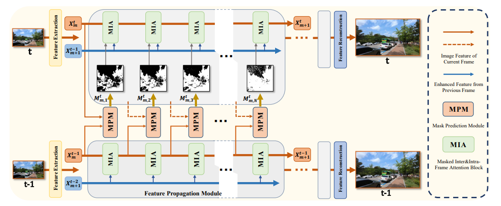
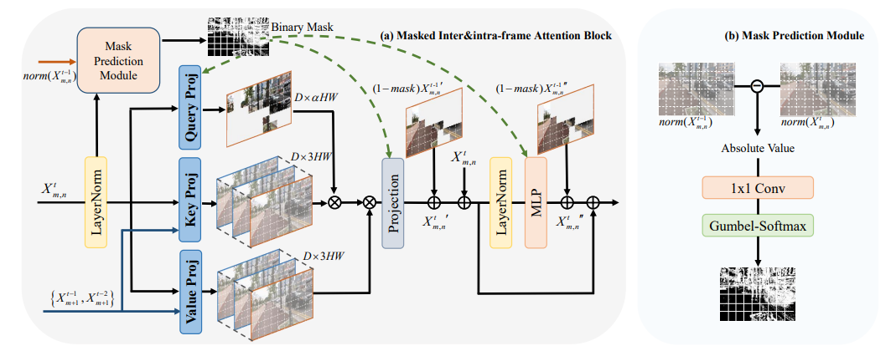
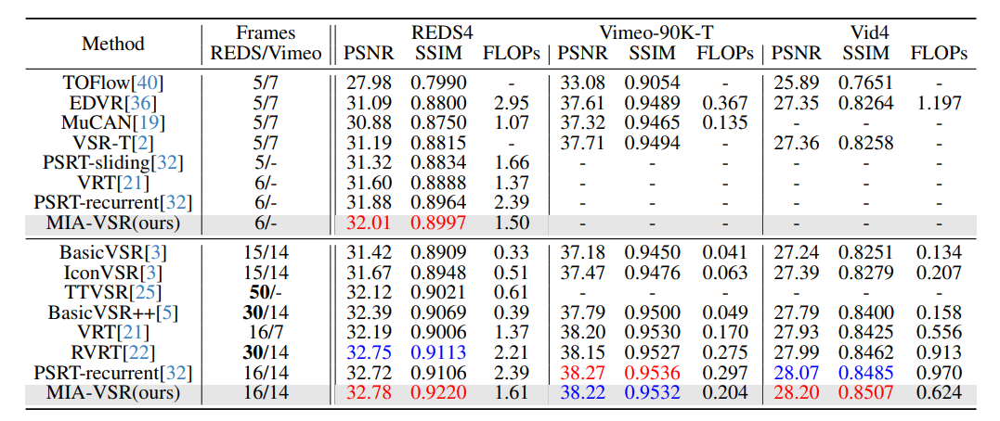

# Video Super-Resolution Transformer with Masked Inter&Intra-Frame Attention（CVPR 2024）
[Xingyu Zhou](https://scholar.google.com/citations?user=dgO3CyMAAAAJ&hl=zh-CN&oi=sra), [Leheng Zhang](https://scholar.google.com/citations?user=DH1CJqkAAAAJ&hl=zh-CN), [Xiaorui Zhao](https://scholar.google.com/citations?view_op=list_works&hl=zh-CN&authuser=1&user=kiG_knoAAAAJ&gmla=AOAOcb0BKRCA24zlHooXxTCcVT-GviTGSKspWQKYk0UjgwMJrX6lPPMvFn19EPVzIxvZLjzdtdtBAFsVpzxcGiK0I4pKI9se2OinqAW2po3AwX7RO-HsWEMWapQ), [Keze Wang](https://scholar.google.com/citations?hl=zh-CN&user=Qirk2fYAAAAJ), [Leida Li](https://scholar.google.com/citations?hl=zh-CN&user=xMvuFI8AAAAJ) and [Shuhang Gu](https://scholar.google.com/citations?hl=zh-CN&user=-kSTt40AAAAJ) <br>
[arxiv](https://arxiv.org/pdf/2401.06312)
**|**
[pretrained models](https://drive.google.com/drive/folders/1SyCIPlCZp4SkORMaUVKzT0M07nDAhdrl?usp=sharing)

[](https://arxiv.org/abs/2401.06312)
[](https://github.com/LabShuHangGU/MIA-VSR)

This repository is the official PyTorch implementation of "Video Super-Resolution Transformer with Masked Inter&Intra-Frame Attention"
([arxiv](https://arxiv.org/pdf/2401.06312),[pretrained models](https://drive.google.com/drive/folders/1DvsUP-FVwENIpLyeQPQMHc7QnxX1F5Pd?usp=sharing)). 

> Recently, Vision Transformer has achieved great success in recovering missing details in low-resolution sequences, i.e., the video super-resolution (VSR) task. Despite its superiority in VSR accuracy, the heavy computational burden as well as the large memory footprint hinder the deployment of Transformer-based VSR models on constrained devices. In this paper, we address the above issue by proposing a novel feature-level masked processing framework: VSR with Masked Intra and inter-frame Attention (MIA-VSR). The core of MIA-VSR is leveraging featurelevel temporal continuity between adjacent frames to reduce redundant computations and make more rational use of previously enhanced SR features. Concretely, we propose an intra-frame and inter-frame attention block which takes the respective roles of past features and input features into consideration and only exploits previously enhanced features to provide supplementary information. In addition, an
adaptive block-wise mask prediction module is developed to skip unimportant computations according to feature similarity between adjacent frames. We conduct detailed ablation studies to validate our contributions and compare the proposed method with recent state-of-the-art VSR approaches. The experimental results demonstrate that MIAVSR improves the memory and computation efffciency over state-of-the-art methods, without trading off PSNR accuracy.

## Network Architecture
<p align="center">
  
</p>

## Update
[2024/6/13] release codes and models.

## Masked Intra and inter-frame Attention Block
<p align="center">
  
</p>

## Requirements
> - Python 3.8, PyTorch >= 1.9.1
> - Requirements: see requirements.txt
> - Platforms: Ubuntu 18.04, cuda-11.1

## Quick Testing
Download [pretrained models](https://drive.google.com/drive/folders/1DvsUP-FVwENIpLyeQPQMHc7QnxX1F5Pd?usp=sharing) and put them in the appropriate folder. Prepare the [dataset](https://github.com/XPixelGroup/BasicSR/blob/master/docs/DatasetPreparation.md#Video-Super-Resolution) and change the file path in the inference code.

```bash
# download code
git clone https://github.com/LabShuHangGU/MIA-VSR
cd MIA-VSR
pip install -r requirements.txt
pip install basicsr
python setup.py develop

# video sr trained on REDS, tested on REDS4
python inference_miavsr_reds.py

# video sr trained on Vimeo, tested on Vimeo

python inference_miavsr_vimeo90k.py --vimeo data/meta_info_Vimeo90K_train_GT.txt --device 0
```
## Training
Prepare the corresponding datasets follwing the quick test stage. For better I/O speed, you can follow [data prepare instruction](https://github.com/XPixelGroup/BasicSR/blob/master/docs/DatasetPreparation.md#Video-Super-Resolution) to convert `.png` datasets to `.lmdb` datasets.

```bash
# download code
git clone https://github.com/LabShuHangGU/MIA-VSR
cd MIA-VSR
pip install -r requirements.txt
pip install basicsr
python setup.py develop

# video sr trained on REDS, tested on REDS4
bash dist_train.sh 8 options/4126_MIAVSR_mix_precision_REDS_600K_N1.yml

# video sr trained on Vimeo, validated on Vid4
bash dist_train.sh 8 options/5123_MIAVSR_mix_precision_Vimeo_300K_N10.yml
```
We also provide the code for the IIAVSR without the adaptive masked processing module in archs/iia_vsr_arch.py.

## Results
<p align="center">
  
</p>

## Citation
```
@article{zhou2024video,
title={Video Super-Resolution Transformer with Masked Inter\&Intra-Frame Attention},
author={Zhou, Xingyu and Zhang, Leheng and Zhao, Xiaorui and Wang, Keze and Li, Leida and Gu, Shuhang},
journal={arXiv preprint arXiv:2401.06312},
year={2024}
}

```
## Acknowledgment
Our codes was built on [BasicSR](https://github.com/XPixelGroup/BasicSR), [PSRT](https://github.com/XPixelGroup/RethinkVSRAlignment) and partially borrowed from [mmediting](https://github.com/open-mmlab/mmediting).
